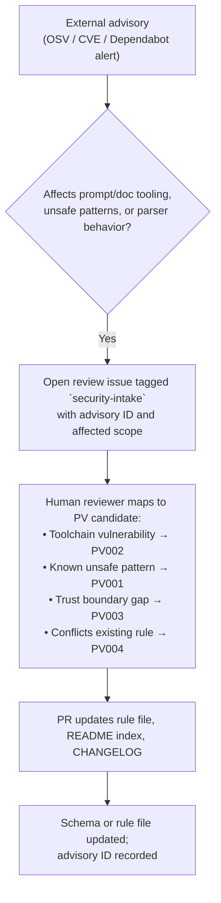

<!-- Above: YAML frontmatter used by tools. -->

# Security Intake

This document specifies how external vulnerability intelligence — CVEs, OSV
advisories, Dependabot alerts, and similar sources — maps to the `PV`
(Security / vulnerability intelligence) rule family and flows into the standard.

> **Related:**
> [Frontmatter Schema](./frontmatter.md) —
> [Context Inclusion](./context-inclusion.md) —
> [PV rule family](../../README.md#security--vulnerability-intelligence-pv) —
> [Document-Driven Design](../philosophy/document-driven-design.md)

## Why security is its own family

Security diagnostics are categorically different from other rule families.
A `PS` or `PC` violation describes a quality problem that can be repaired.
A `PV` violation describes a **known risk** sourced from external intelligence
— it may have no safe automated repair at all.

`fix_kind` answers *how* something can be repaired. `PV` answers *what class
of problem this is*. These are orthogonal axes and must stay separate. A `PV`
rule will almost always carry `fix_kind: NONE` because the correct response is
human review, not automated patching.

## Advisory sources

The standard recognises three primary intake channels:

| Source | Format | What it covers |
|---|---|---|
| [OSV](https://osv.dev) | OSV JSON | Open-source package vulnerabilities across ecosystems |
| CVE / NVD | CVE JSON | Broadly published vulnerability identifiers |
| Dependabot / GitHub | GitHub Advisory DB | Dependency alerts surfaced in CI for the repo's own toolchain |

OSV is the preferred machine-readable format because it describes affected
packages, version ranges, and ecosystems precisely. Tools integrating advisory
intake SHOULD prefer OSV records where available.

## The intake flow

Advisories do not automatically become rule changes. The flow has a mandatory
human review gate:



Automation (Dependabot, OSV scanners) feeds the top of this funnel.
Human judgment is required at every step after that.

## Optional security frontmatter

Files that consume untrusted input or have been reviewed against advisories
MAY declare this in frontmatter using `x-security`:

```yaml
x-security:
  consumes_untrusted_input: true
  trust_boundary: "user-content-delimited"
  advisory_reviewed_at: "2026-04-19"
  advisory_sources:
    - osv
    - github
```

This is an extension field (`x-*`) and is not validated by the core schema.
Tools that understand it SHOULD surface it; tools that do not MUST ignore it.

## What this standard does not replace

The `PV` family and this intake process cover prompt- and document-pipeline
risks. They are not a substitute for broader security and privacy tooling:

- **Secret detection** — use dedicated scanners such as
  [Gitleaks](https://github.com/gitleaks/gitleaks) or
  [TruffleHog](https://github.com/trufflesecurity/trufflehog) to scan code,
  configs, and history for hard-coded credentials.
- **PII and sensitive data scanning** — use freely available tools designed
  for this job, such as [Microsoft Presidio](https://github.com/microsoft/presidio)
  for text and image anonymization pipelines or
  [Hawk Eye](https://github.com/rohitcoder/hawk-eye) for scanning filesystems
  and storage backends for PII and sensitive data.
- **Dependency vulnerability patching** — use GitHub Dependabot or equivalent
  to track advisories for your dependencies and open upgrade pull requests
  automatically.
- **Runtime behavioral evals** — use runtime analytics systems or evaluation
  harnesses to detect harmful behavior over time. This standard defines static
  rule structures, not runtime scoring.

When referencing adjacent tools, prefer options that are free to use,
preferably open source, and easy to automate locally or in CI. Tools with
simple CLI installation, Docker entrypoints, or support for git-hook
automation frameworks such as `pre-commit`, `prek`, Husky, or plain
`.git/hooks` are especially useful for teams adopting this standard
incrementally.

Integrations are encouraged: prompt linters and formatters SHOULD call out to
these systems where appropriate, but MUST NOT attempt to re-implement them as
`PV` rules.

## Keeping advisories out of rule logic

Rule files MUST NOT embed raw advisory text or CVE descriptions. The rule file
describes the *class* of problem (`PV001`: known vulnerable pattern reference).
A separate advisory record or issue links the specific CVE or OSV ID to that
class. This keeps rule definitions stable even as the advisory landscape changes.
